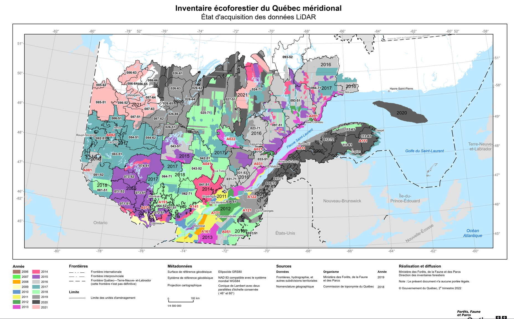
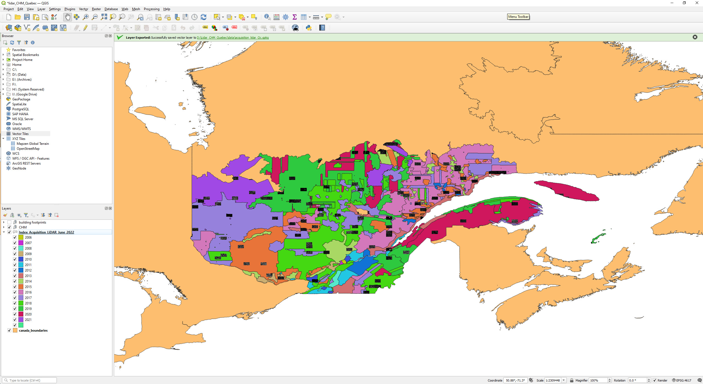

Updated on janv. 19 2023

-------

This folder contains information about lidar-derived data products derived from the Province of Quebec Lidar acquisition program, which is available for the entirety of the area south of the northern limit of the managed forest.

The year of LiDAR data acquisition is illustrated below. ([Shapefile available here][01])

### Content

* *[./data/CHM_rasters/][02]* - A random sample of CHM raster files (1-m resolution) downloaded from [Donnees Quebec - Modeles numeriques (terrain, canopee, pente)][11]. The file *[./data/CHM_URL-list.csv][05]* contains a complete list of URL where CHM files can be found. Files were renamed. See *[./data/CHM_metadata.csv][04]* for details.
* *[./data/buildingFootprints/][03]* - Unprocessed shapefiles downloaded from [Donnees Quebec - Empreintes de batiments][12]. 
* *[./scripts/][04]* - A few R scripts that were used to download files from Quebec's data portal. Some error handling/recovery had to be implemented. You can also use your own scripts in combinations with the *[CHM_URL-list.csv][05]* file.

#### Current sample of CHM raster files 

#### Additional info
Both data products originate from the same Lidar data.

The CHM raster files have NOT been processed to remove buildings and other elevated infrastructures.

"Automatically Extracted Buildings" is a raw digital product in vector format created by NRCan, based on Quebec 
Lidar acquisition program. It consists of a single topographical feature class that delineates polygonal building footprints automatically extracted from airborne Lidar data, high-resolution optical imagery or other sources, following the algorithms developed by Natural Resources Canada. More information is avialable on the [Open Canada web portal][13].

It DOES NOT cover the entire landbase, although significant areas are covered.

More detailed vectorial data produced by municipalities exist and are available on the data portal
of the Province of Quebec, but it has not been gathered in a comprehensive repository yet. 

Don't hesitate to contact the owner of this repo should you have any questions.

[01]: https://github.com/dcyr/Lidar_CHM_Quebec/blob/master/data/other
[02]: https://github.com/dcyr/Lidar_CHM_Quebec/blob/master/data/CHM_rasters
[03]: https://github.com/dcyr/Lidar_CHM_Quebec/blob/master/data/buildingFootprints
[04]: https://github.com/dcyr/Lidar_CHM_Quebec/blob/master/data/CHM_metadata.csv
[05]: https://github.com/dcyr/Lidar_CHM_Quebec/blob/master/data/CHM_URL-list.csv

[11]: https://www.donneesquebec.ca/recherche/dataset/produits-derives-de-base-du-lidar
[12]: https://www.donneesquebec.ca/recherche/dataset/empreintes-de-batiments
[13]: https://open.canada.ca/data/en/dataset/7a5cda52-c7df-427f-9ced-26f19a8a64d6

